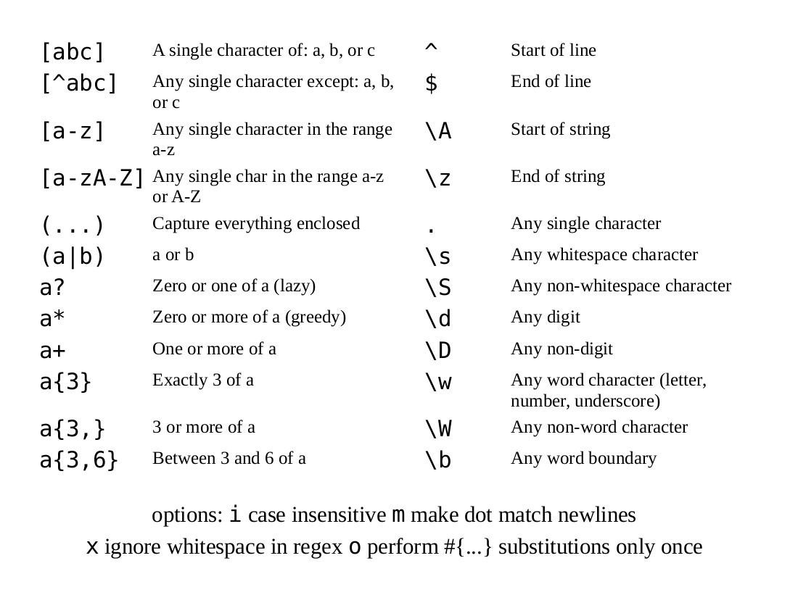

## Back of the Napkin RegEx

Amanda Hickman, Chrys Wu, Kennedy Elliott

NOTES:

I teach data reporting at UC Berkeley and am working on some yet-to-be-unveiled investigative data projects. This is almost entirely a wholesale repeat of a workshop I lead in 2014 -- Regular expressions don't change that much. (If I'm being honest my heart is still at CUNY.) The thing I'm proudest of right now is that I successfully lobbied the Unicode Consortium Emoji Subcommittee to add a safety pin, ball of yarn and spool to your keyboards. They rejected the needle and thread but I'm not a quitter.

--v--

NOTES:

Regular expressions are statements that you make in a pattern matching language.

I can search for all the instances of "regular expressions" and replace them with "regex" without doing anything fancy. But if I want to find all the instances of "Jim" and "Jimmy" and change them to "James", I need something a little more complex.

Two terms you're going to hear: "strings" just means a bunch of characters strung together. Letters are characters, numbers are characters. Curly braces and plus signs are characters.

I even made you a little [cheatsheet](2018/NICAR/cheatsheet.pdf). Once upon a time I had aspirations of actually printing these on napkins but I'm cheap.

--v--

### RegEx

TODO: get full URL for xkcd

It will shock you to learn that Wikipedia has an extensive and thorough history of <u>[regular expressions](http://en.wikipedia.org/wiki/Regular_expression)</u>.

NOTES:
It will shock you to learn that Wikipedia has an extensive and thorough history of [regular expressions](http://en.wikipedia.org/wiki/Regular_expression).

The first awesome thing about regular expressions is that they're not actually regular. When you start getting fancy you'll start to discover that applications can vary subtly in their implementation.

-----

### Get Started

    NAME: Sean Burnett POS: RP AGE: 30 WT: 200 BORN: Dunedin, FL SALARY: 2350000    
    NAME: Tyler Clippard POS: RP AGE: 27 WT: 200 BORN: Lexington, KY SALARY: 1650000    
    NAME: Ross Detwiler-Smith POS: SP AGE: 26 WT: 174 BORN: St. Louis, MO SALARY: 485000    
    NAME: Christian Garcia POS: RP AGE: 27 WT: 215 BORN: Miami, FL SALARY: N/A
    NAME: Gio Gonzalez POS: SP AGE: 27 WT: 205 BORN: Hialeah, FL SALARY: 3335000    
    NAME: Mike Gonzalez POS: RP AGE: 34 WT: 215 BORN: Robstown, TX SALARY: N/A
    NAME: Ryan P. Mattheus POS: RP AGE: 28 WT: 215 BORN: Sacramento, CA SALARY: 481000    
    NAME: Craig Stammen POS: RP AGE: 28 WT: 200 BORN: Coldwater, OH SALARY: 485000    
    NAME: Drew Storen POS: RP AGE: 25 WT: 180 BORN: Indianapolis, IN SALARY: 498750    
    NAME: Jordan Q. Zimmermann POS: SP AGE: 26 WT: 218 BORN: Auburndale, WI SALARY: 2300000    

tip: <http://rubular.com/> and <http://regex101.com/> will make this easier

NOTES:

I like to start with a manageable block of text, one where you can *see* what you're up against just fine.

This is player data from the Washington Nationals 2012 lineup that I stole from [Anthoney DeBarros](http://www.anthonydebarros.com/2012/10/09/excel-extract-text-find-mid-string/) who uses it to demonstrate some cool Excel functions, which will also work if you want to break this all up. I sometimes think it wouldn't kill me to get more current data, but I haven't yet. I did alter it subtly to make our challenge more fun.

We're going to use two tools:

[Rubular](http://rubular.com/) and [RegEx 101](http://regex101.com/) to work through our puzzles today.

Let's say, hypothetically, that I want to put this in a spreadsheet. And I want all the data in columns. I can't just use `text to columns` because there's no delimiter.

So I want us to start by walking through how we can turn that into something closer to...

--v--
### What we really want is more like this:

    Sean Burnett, RP, 30, 200, Dunedin, FL, 2350000    
    Tyler Clippard, RP, 27, 200, Lexington, KY, 1650000    
    Ross Detwiler-Smith, SP, 26, 174, St. Louis, MO, 485000    
    Christian Garcia, RP, 27, 215, Miami, FL, N/A
    Gio Gonzalez, SP, 27, 205, Hialeah, FL, 3335000    
    Mike Gonzalez, RP, 34, 215, Robstown, TX, N/A
    Ryan P. Mattheus, RP, 28, 215, Sacramento, CA, 481000    
    Craig Stammen, RP, 28, 200, Coldwater, OH, 485000    
    Drew Storen, RP, 25, 180, Indianapolis, IN, 498750    
    Jordan Q. Zimmermann, SP, 26, 218, Auburndale, WI, 2300000    

--v--

    NAME: \w*    # Not a bad start.  

NOTES:

Start with the name. We're going to walk through this together and you should sketch out on a napkin how you think we can solve each piece of the puzzle.

TO DO: check the Rubular URLS

<http://rubular.com/r/OCClBeRKQi>

--v--

    NAME: \w* \w*    # Better, but check out Jordan Q. Zimmerman, Ross Detwiler-Smith

--v--

    NAME: \w*[-\w. ]*\w* # Now we have everyone.

--v--

    NAME: (\w*[-\w. ]*\w*) POS:

NOTES:

But we want to be able to make replacements, so we're going to start grouping the good stuff:    

--v--

    NAME: (\w*[-\w .]*\w*[ ]*) POS: ([A-Z][A-Z])

--v--

    NAME: (\w*[-\w .]*\w*[ ]*) POS: ([A-Z]{2})

--v--

    NAME: (\w*[-\w .]*\w*[ ]*) POS: ([A-Z]{2}) AGE: (\d\d) WT: (\d{3}) BORN: .* SALARY: (\d+|N\/A)

NOTES:

Unpack the SALARY "or" statement: \d* will match 0 or more and stop. We want 1 or more. This is why I like Rubular, it shows you your matches. <http://rubular.com/r/lmLv0Igsdo>

But now is a good time to take this over to [Regex101](http://regex101.com/) to see it all colorized http://regex101.com/r/vS5eT3

TODO: Why switch between Regex101 and Rubular?

--v--

### Homework!

Can you convert dates from 1/12/99 to 1999-12-01.

-----

### Next Puzzle

      (310) 808-5243        
      415.846.1688    
      7203189049    
      3238886200    
      323.888.6237    
      323-888-6209    
      323/888.6202    
      3237078576    
      (323) 216-2201    
      323.960.3100    
      7274554538    
      727-214-5862    
      727/455.5955    
      424-209-0017    
      305-242-4044    
      (305) 245-1641    
      8184813655    
      909.259.5674    
      (469) 438-2843    
      323/216.9079    
      323/953.3340    
      916-588-8042    
      7273247922    
      310.800.3391    
      4157978909    
      727.639.0277    
      323.386.5239    
      213.840.1971    
      4242007177    
      323/816.9831    
      310-404-5928    
      323-492-7681    
      323-833-8515    
      323-386-5428    
      (323) 244-3832    
      310/808.8752    
      323.855.0394    
      214/900.6004    
      727-687-3465    
      (646) 879-9137    
      3239533396    
      323-816-9613    
      323/816.7010    
      323.273.5174    
      323-386-5700    
      323.386.5699    
      818-859-4757    
      727-452-5725    
      (323) 608-1510    
      4088294846    
      323-997-1080    
      (323) 855-0338    
      323.717.8673    
      323/419.6398    
      3235950799    
      323-240-2739    

NOTES:

[A Bunch of Random Phone Numbers](/talks/2014/NICAR/regex/sample files/Sample Text Phone Numbers.txt)

TODO: make sure these are actually available on etherpad or Regex101 (they're on your computer)

TODO: Check atom replace syntax -- it's $1, not \1

--v--

**Search String**   

    ([0-9]{3})[-. )\/]*([0-9]{3})\D*([0-9]{4})

--v--

**Better Search String**

    \(*([0-9]{3})\D*([0-9]{3})\D*([0-9]{4})

--v--

**Replace String**

    \(\1\) \2-\3

**Unless you're in Atom**

    ($1) $2-$3

NOTES:

This particular challenge was designed to make you angry at forms that balk at phone number formats.

-----

## Thank you!

* Dan Nguyen is awesome. His book [The Bastards Book of Regular Expressions](https://leanpub.com/bastards-regexes) is also awesome.  

* Check out the <http://callumacrae.github.io/regex-tuesday/> Tuesday Challenge or
* <https://www.hackerrank.com/categories/miscellaneous/regex> Hacker Rank's Challenges.
* <http://regexcrossword.com> RegEx Crosswords are fun, if cryptic.  
* <http://www.rexegg.com/regex-lookarounds.html> Lookaheads will make your brain hurt a little, but that doesn't mean they aren't worth understanding.
